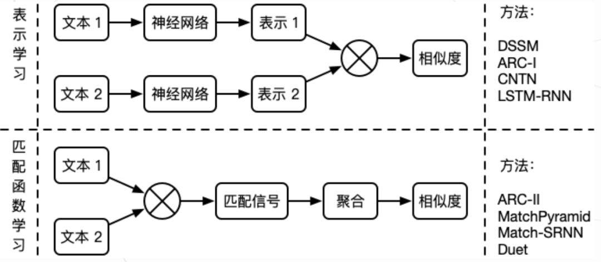
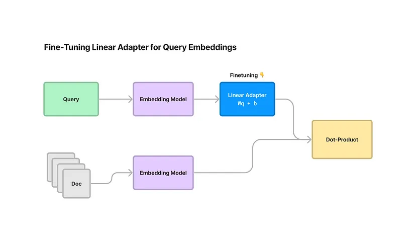

# Embedding fine-tuning

Tags: Embedding

## Semantic search

### **Symmetric vs. Asymmetric Semantic Search**

- 对称语义搜索指的是query和语料中的实体存在交叉（句式，单词）。例子：基于当前的问题去搜索相似的问题，比如：如何在线学习Python？它也可以是：如何在网上学习Python？
- 非对称语义搜索通常是，从一个query检索得到一段较长的语料。例如：什么是Python？你想要的结果是Python的具体定义，比如：Python是可解释的高级编程语言…。对于非对称任务，query和语料通常不存在交叉（句式，单词）。

<!-- more -->

## Retrieve & Re-rank pipeline


Retrieval: Bi-encoder; Symmetric & Asymmetric semantic search

财税GPT中，关键词搜索是一种对称检索，数据embedding则选择了title+body的方式，是一种对称与非对称结合的方式，总的来说，对称语义检索的比重会大。为什么选择title+body的方式主要是由于通用embedding在非对称场景下效果不佳。只能选择折中的方式。

Reranker: Cross-encoder



### Fine-tuning

1. 基于文本生成关于文本的多样性问题，构成文本对。
2. 硬负样本挖掘，构建负样本。
3. Fine-tuning embedding模型（fine-tuning embedding adapter）
4. 评估

#### Synthetic data

基于文本内容利用大模型生成针对内容的多样性问题。

#### Hard Negatives

```json
{"query": str, "pos": List[str], "neg":List[str]}
// pos是正样本list，neg是负样本list，如果没有负样本，可以从整个预料中随机选择数据作为负样本。
```

从一个范围内随机选取负样本

范围的选择：

- query召回后选择topM-topN
- query召回后，随机采样相似性分数位于0.3-0.7的样本

#### Fine-tuning embedding adapter

无需重建文档embedding索引，可以被用于任何embedding模型



Adapter是一个线性变换的模块，新的query embedding结合adapter可以表示为：

$$
{q_t} = Wq + b
$$

损失函数：This loss expects as input a batch consisting of sentence pairs `(a_1, p_1), (a_2, p_2)..., (a_n, p_n)`
where we assume that **`(a_i, p_i)` are a positive pair** and **`(a_i, p_j)` for `i != j` a negative pair.**

## LlamaIndex Fine tuning

### Load data

```python
TRAIN_FILES = ["./data/10k/lyft_2021.pdf"]
VAL_FILES = ["./data/10k/uber_2021.pdf"]

TRAIN_CORPUS_FPATH = "./data/train_corpus.json"
VAL_CORPUS_FPATH = "./data/val_corpus.json"

def load_corpus(files, verbose=False):
    if verbose:
        print(f"Loading files {files}")

    reader = SimpleDirectoryReader(input_files=files)
    docs = reader.load_data()
    if verbose:
        print(f"Loaded {len(docs)} docs")

    parser = SentenceSplitter()
    nodes = parser.get_nodes_from_documents(docs, show_progress=verbose)

    if verbose:
        print(f"Parsed {len(nodes)} nodes")

    return nodes
    
train_nodes = load_corpus(TRAIN_FILES, verbose=True)
val_nodes = load_corpus(VAL_FILES, verbose=True)
```

### Generating synthetic data

```python
from llama_index.finetuning import generate_qa_embedding_pairs
from llama_index.core.evaluation import EmbeddingQAFinetuneDataset

import os

OPENAI_API_KEY = "sk-"
os.environ["OPENAI_API_KEY"] = OPENAI_API_KEY

from llama_index.llms.openai import OpenAI

train_dataset = generate_qa_embedding_pairs(
    llm=OpenAI(model="gpt-3.5-turbo"), nodes=train_nodes
)
val_dataset = generate_qa_embedding_pairs(
    llm=OpenAI(model="gpt-3.5-turbo"), nodes=val_nodes
)

train_dataset.save_json("train_dataset.json")
val_dataset.save_json("val_dataset.json")
```

### Run Embedding Finetuning

```python
from llama_index.finetuning import SentenceTransformersFinetuneEngine

finetune_engine = SentenceTransformersFinetuneEngine(
    train_dataset,
    model_id="BAAI/bge-small-en",
    model_output_path="test_model",
    val_dataset=val_dataset,
)

finetune_engine.finetune()

embed_model = finetune_engine.get_finetuned_model()
```

#### DataLoader

```python
for query_id, query in dataset.queries.items():
    if use_all_docs:
        for node_id in dataset.relevant_docs[query_id]:
            text = dataset.corpus[node_id]
            example = InputExample(texts=[query, text])
            examples.append(example)
    else:
        node_id = dataset.relevant_docs[query_id][0]
        text = dataset.corpus[node_id]
        example = InputExample(texts=[query, text])
        examples.append(example)
```

### Key Path

#### Loss

Batch内的其他样本作为负样本

```python
import torch
from torch import nn, Tensor
from typing import Iterable, Dict
from ..SentenceTransformer import SentenceTransformer
from .. import util

class MultipleNegativesRankingLoss(nn.Module):
    def __init__(self, model: SentenceTransformer, scale: float = 20.0, similarity_fct=util.cos_sim):
        """
        This loss expects as input a batch consisting of sentence pairs ``(a_1, p_1), (a_2, p_2)..., (a_n, p_n)``
        where we assume that ``(a_i, p_i)`` are a positive pair and ``(a_i, p_j)`` for ``i != j`` a negative pair.

        For each ``a_i``, it uses all other ``p_j`` as negative samples, i.e., for ``a_i``, we have 1 positive example
        (``p_i``) and ``n-1`` negative examples (``p_j``). It then minimizes the negative log-likehood for softmax
        normalized scores.

        This loss function works great to train embeddings for retrieval setups where you have positive pairs
        (e.g. (query, relevant_doc)) as it will sample in each batch ``n-1`` negative docs randomly.

        The performance usually increases with increasing batch sizes.

        You can also provide one or multiple hard negatives per anchor-positive pair by structering the data like this:
        ``(a_1, p_1, n_1), (a_2, p_2, n_2)``. Then, ``n_1`` is a hard negative for ``(a_1, p_1)``. The loss will use for
        the pair ``(a_i, p_i)`` all ``p_j`` for ``j != i`` and all ``n_j`` as negatives.

        :param model: SentenceTransformer model
        :param scale: Output of similarity function is multiplied by scale value
        :param similarity_fct: similarity function between sentence embeddings. By default, cos_sim. Can also be set to dot product (and then set scale to 1)

        References:
            - Efficient Natural Language Response Suggestion for Smart Reply, Section 4.4: https://arxiv.org/pdf/1705.00652.pdf
            - `Training Examples > Natural Language Inference <../../examples/training/nli/README.html>`_
            - `Training Examples > Paraphrase Data <../../examples/training/paraphrases/README.html>`_
            - `Training Examples > Quora Duplicate Questions <../../examples/training/quora_duplicate_questions/README.html>`_
            - `Training Examples > MS MARCO <../../examples/training/ms_marco/README.html>`_
            - `Unsupervised Learning > SimCSE <../../examples/unsupervised_learning/SimCSE/README.html>`_
            - `Unsupervised Learning > GenQ <../../examples/unsupervised_learning/query_generation/README.html>`_

        Requirements:
            1. (anchor, positive) pairs or (anchor, positive, negative) triplets

        Relations:
            - :class:`CachedMultipleNegativesRankingLoss` is equivalent to this loss, but it uses caching that allows for
              much higher batch sizes (and thus better performance) without extra memory usage. However, it requires more
              training time.
            - :class:`MultipleNegativesSymmetricRankingLoss` is equivalent to this loss, but with an additional loss term.
            - :class:`GISTEmbedLoss` is equivalent to this loss, but uses a guide model to guide the in-batch negative
              sample selection. `GISTEmbedLoss` yields a stronger training signal at the cost of some training overhead.

        Inputs:
            +---------------------------------------+--------+
            | Texts                                 | Labels |
            +=======================================+========+
            | (anchor, positive) pairs              | none   |
            +---------------------------------------+--------+
            | (anchor, positive, negative) triplets | none   |
            +---------------------------------------+--------+

        Example:
            ::

                from sentence_transformers import SentenceTransformer, losses, InputExample
                from torch.utils.data import DataLoader

                model = SentenceTransformer('distilbert-base-uncased')
                train_examples = [
                    InputExample(texts=['Anchor 1', 'Positive 1']),
                    InputExample(texts=['Anchor 2', 'Positive 2']),
                ]
                train_dataloader = DataLoader(train_examples, shuffle=True, batch_size=32)
                train_loss = losses.MultipleNegativesRankingLoss(model=model)
                model.fit(
                    [(train_dataloader, train_loss)],
                    epochs=10,
                )
        """
        super(MultipleNegativesRankingLoss, self).__init__()
        self.model = model
        self.scale = scale
        self.similarity_fct = similarity_fct
        self.cross_entropy_loss = nn.CrossEntropyLoss()

    def forward(self, sentence_features: Iterable[Dict[str, Tensor]], labels: Tensor):
        reps = [self.model(sentence_feature)["sentence_embedding"] for sentence_feature in sentence_features]
        embeddings_a = reps[0] # query embedding
        embeddings_b = torch.cat(reps[1:]) # context embedding

        scores = self.similarity_fct(embeddings_a, embeddings_b) * self.scale
        labels = torch.tensor(
            range(len(scores)), dtype=torch.long, device=scores.device
        )  # Example a[i] should match with b[i]
        return self.cross_entropy_loss(scores, labels)

    def get_config_dict(self):
        return {"scale": self.scale, "similarity_fct": self.similarity_fct.__name__}

```

## Evaluate

1. Hit rate: 对于每一个(query, context) 对，使用query检索得到topk文档。如果结果包含context，这就是一次命中。
2. Mean Reciprocal Rank: 这是一个稍微更精细的排名度量标准，它着眼于topk检索到的文档中context的倒数排名，倒数排名定义为：1/rank。 当然如果结果不包含context，mrr=0
3. `InformationRetrievalEvaluator` from sentence_transformers.

### Adapter evaluate

小批量百级数据对比

|  | retrievers | hit_rate | mrr |
| --- | --- | --- | --- |
| 0 | ada | 0.914286 | 0.758095 |
| 1 | bge-small-zh-v1.5 | 0.942857 | 0.852857 |
| 2 | ft-ada | 0.928571 | 0.768810 |

中批量1k数据对比

|  | retrievers | hit_rate | mrr |
| --- | --- | --- | --- |
| 0 | ada | 0.914286 | 0.758095 |
| 1 | bge-small-zh-v1.5 | 0.942857 | 0.852857 |
| 2 | ft-ada | 0.928571 | 0.768810 |

adapter不适合大量数据的fine-tuning，参数太少导致微调效果不明显甚至变差。

### Fine-tuning evaluate

中批量1k数据对比

|  | retrievers | hit_rate | mrr |
| --- | --- | --- | --- |
| 0 | ada | 0.468992 | 0.348514 |
| 1 | bge-m3 | 0.488372 | 0.377132 |
| 2 | bge-m3-ft | 0.534884 | 0.417765 |
| 3 | ali | 0.437984 | 0.329780 |

大批量8k数据对比

|  | retrievers | hit_rate | mrr |
| --- | --- | --- | --- |
| 0 | ada | 0.708678 | 0.546901 |
| 1 | bge-m3 | 0.803719 | 0.639715 |
| 2 | bge-m3-ft-epoch-1 | 0.858815 | 0.706623 |
| 3 | bge-m3-ft-epoch-5 | 0.860882 | 0.73478 |
| 3 | ali | 0.694215 | 0.517769 |

## Reference

1. https://github.com/FlagOpen/FlagEmbedding/blob/master/FlagEmbedding/baai_general_embedding/finetune/hn_mine.py
2. [https://blog.csdn.net/qq_44193969/article/details/134042750](https://blog.csdn.net/qq_44193969/article/details/134042750)
3. [https://www.llamaindex.ai/blog/fine-tuning-a-linear-adapter-for-any-embedding-model-8dd0a142d383](https://www.llamaindex.ai/blog/fine-tuning-a-linear-adapter-for-any-embedding-model-8dd0a142d383)