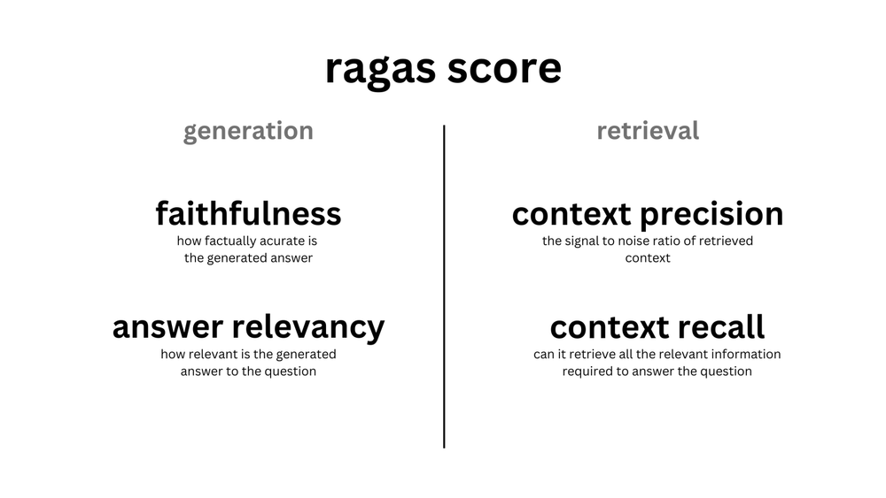
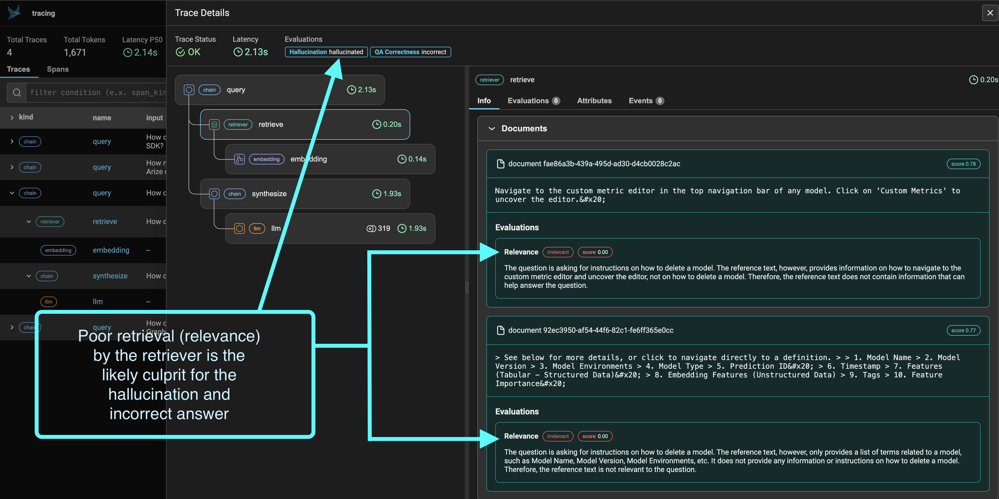

# RAG-evaluate

## Categories of metrics:

- Metrics based on the ground truth
- Metrics without the ground truth
- Metrics based on LLM response

<!-- more -->

### Metrics based on the ground truth

**ground truth V.S. generated answer**

- answer semantic similarity
- answer correctness

**ground truth V.S. relevant documents**

- exact match
- Rouge-L
- F1

### Metrics without the ground truth

**Query V.S. relevant documents V.S. generated answer**

- **Context relevance**: Measures how well the retrieved context supports the query.
- **Groundedness**: Assesses the extent to which the LLM's response aligns with the retrieved context.
- **Answer Relevance**: Gauges the relevance of the final response to the query.

### Metrics based on LLM response

harmfulness, maliciousness, coherence, correctness, conciseness

[Langchain Critique](https://python.langchain.com/docs/guides/productionization/evaluation/string/criteria_eval_chain/#custom-criteria)

## RAG evaluate tools

### Ragas

#### Core Concepts

1. Synthetically generate a diverse test dataset that you can use to evaluate your app.
2. Use LLM-assisted evaluation metrics designed to help you objectively measure the performance of your application.
3. Monitor the quality of your apps in production using smaller, cheaper models that can give actionable insights. For example, the number of hallucinations in the generated answer.
4. Use these insights to iterate and improve your application.

#### MDD(metrics-Driven Development)

While creating a fundamental LLM application may be straightforward, the challenge lies in its ongoing maintenance and continuous enhancements. Ragas’s vision is to facilitate the continuous improvement of LLM and RAG applications by embracing the ideology of Metrics-Driven Development(MDD).

MDD is a product development approach that relies on data to make well-informed decisions. This approach entails the ongoing monitoring of essential metrics over time, providing valuable insights into an application’s performance.

- Evaluate: This enables you to assess LLM applications and conduct experiments in a metric-assisted manner, ensuring high dependability and reproducibility.
- Monitoring: It allows you to gain valuable and actionable insights from production data points, facilitating the continuous improvement of the quality of your LLM application.

#### Metrics
##### Component-Wise Evaluation

- **[Faithfulness](https://docs.ragas.io/en/stable/concepts/metrics/faithfulness.html)**
    
   | Steps | Examples                                                                                                        |
   | --- |-----------------------------------------------------------------------------------------------------------------|
   | Step1: Break the generated answer into individual statements. | Statements:Statement 1: “Einstein was born in Germany.” Statement 2: “Einstein was born on 20th March 1879.” |
   | Step2: For each of the generated statements, verify if it can be inferred from the given context. | Statement 1: Yes Statement 2: No                                                                             |
   | Step3: Use the formula depicted above to calculate faithfulness. | Faithfulness = 1/2 = 0.5                                                                                        |

  - **[Answer relevancy](https://docs.ragas.io/en/stable/concepts/metrics/answer_relevance.html)**
    
   | Steps | Examples                                                                                                                                                                                                              |
   | --- |-----------------------------------------------------------------------------------------------------------------------------------------------------------------------------------------------------------------------|
   | Step1: Reverse-engineer ‘n’ of the question from the generated answer using a LLM. For instance, for the first answer, the LLM might generate the following possible questions: | Question 1: “In which part of Europe is France located?” Question 2: “What is the geographical location of France within Europe?” Question 3: “Can you identify the region of Europe where France is situated?” |
   | Step2: Calculate the mean cosine similarity between the generated questions and the actual question. |                                                                                                                                                                                                                       |
  
  - **[Context recall](https://docs.ragas.io/en/stable/concepts/metrics/context_recall.html)**
    
  | Steps | Examples                                                                                                               |
  | --- |------------------------------------------------------------------------------------------------------------------------|
  | Step1: Break the ground truth answer into individual statements | Statements: Statement 1: “France is in Western Europe.” Statement 2: “Its capital is Paris.”                     |
  | Step2: For each individual statements, verify if it is can be attributed to the retrieved context. | Statement 1: Yes                                                                                    Statement 2: No |
  | Step3: Use the formula depicted above to calculate context recall. | context recall = 1/2 = 0.5                                                                                             |
  
   - **[Context precision](https://docs.ragas.io/en/stable/concepts/metrics/context_precision.html)**
    
  | Steps | Examples                                         |
  | --- |--------------------------------------------------|
  | Step1: For each chunk in retrieval context, check if it is relevant or not relevant to arrive at the ground truth for the given question. |                                                  |
  | Step2: calculate precisionTOP@K for each chunk in the context | precision@1 = 0/1 = 0 precision@2 = 1/2 = 0.5 |
  | Step3: calculate the mean of precisionTOP@K to arrive at the final context precision score. | context precision = (0+0.5)/1 = 0.5              |
  
   - **[Context relevancy](https://docs.ragas.io/en/stable/concepts/metrics/context_relevancy.html)**
    
$$ relevant\ score = \frac{relevant\ sentences}{total\ number\ of\ sentences\ in\ retrieved\ context} $$

  - **[Context entity recall](https://docs.ragas.io/en/stable/concepts/metrics/context_entities_recall.html)**
    
  | Steps | Examples |
  | --- | --- |
  | Step1: Find entities present in the ground truth. | • Entities in ground truth (GE) - [‘Taj Mahal’, ‘Yamuna’, ‘Agra’, ‘1631’, ‘Shah Jahan’, ‘Mumtaz Mahal’] |
  | Step2: Find entities present in the context. | Entities in context (CE1) - [‘Taj Mahal’, ‘Agra’, ‘Shah Jahan’, ‘Mumtaz Mahal’, ‘India’] Entities in context (CE2) - [‘Taj Mahal’, ‘UNESCO’, ‘India’]|
  | Step3: Use the formula given above to calculate entity-recall  |  |

$$
context\ entity\ recall-1=\frac{|CE1 \cap GE|}{|GE|} = 4/6 = 0.666
$$

$$
context\ entity\ recall-2 = \frac{|CE2\cap GE|}{|GE|} = 1/6=0.1666
$$

##### End-to-End Evaluation(You must have ground truth)

- **[Answer semantic similarity](https://docs.ragas.io/en/stable/concepts/metrics/semantic_similarity.html)**
    
    **Step 1:** Vectorize the ground truth answer using the specified embedding model.
    
    **Step 2:** Vectorize the generated answer using the same embedding model.
    
    **Step 3:** Compute the cosine similarity between the two vectors.
    
- **[Answer correctness](https://docs.ragas.io/en/stable/concepts/metrics/answer_correctness.html)**
    
  Calculate the the similarity between ground truth and generated answer, and calculate the F1-score.
    
- Aspect critique

SUPPORTED_ASPECTS = [ harmfulness, maliciousness, coherence, correctness, conciseness, ]

#### Prompt Objects

- Automatic Prompt Adaption: 根据输入语言自动调整prompt语言
- Synthetic test data generation: 合成测试数据

### TruLen

#### RAG Traid

The RAG Traid is made up of 3 evaluations: context relevance, groundtruthness and answer relevance.

##### Context Relevance

The first step of any RAG application is retrieval; to verify the quality of our retrieval, we want to make sure that each chunk of context is relevant to the input query. This is critical because this context will be used by the LLM to form an answer, so any irrelevant information in the context could be weaved into a hallucination. TruLens enables you to evaluate context relevance by using the structure of the serialized record.

##### Groundtruthness

After the context is retrieved, it is then formed into an answer by an LLM. LLMs are often prone to stray from the facts provided, exaggerating or expanding to a correct-sounding answer. To verify the groundedness of our application, we can separate the response into individual claims and independently search for evidence that supports each within the retrieved context.

##### Answer Relevance

Last, our response still needs to helpfully answer the original question. We can verify this by evaluating the relevance of the final response to the user input.

##### Put it together

By reaching satisfactory evaluations for this triad, we can make a nuanced statement about our application’s correctness; our application is verified to be hallucination free up to the limit of its knowledge base. In other words, if the vector database contains only accurate information, then the answers provided by the RAG are also accurate.

### Arize-AI Phoenix

Phoenix is an open-source observability library designed for experimentation, evaluation, and troubleshooting. It allows AI Engineers and Data Scientists to quickly visualize their data, evaluate performance, track down issues, and export data to improve.

#### Tracing and eval

## Reference

1. https://zilliz.com/blog/how-to-evaluate-retrieval-augmented-generation-rag-applications
2. https://techcommunity.microsoft.com/t5/microsoft-developer-community/evaluating-rag-applications-with-azureml-model-evaluation/ba-p/4108603
3. [https://www.rungalileo.io/blog/mastering-rag-llm-prompting-techniques-for-reducing-hallucinations#expertprompting](https://www.rungalileo.io/blog/mastering-rag-llm-prompting-techniques-for-reducing-hallucinations#expertprompting)
4. https://huggingface.co/learn/cookbook/rag_evaluation