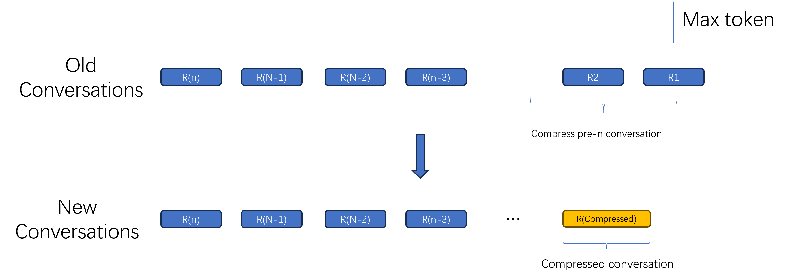
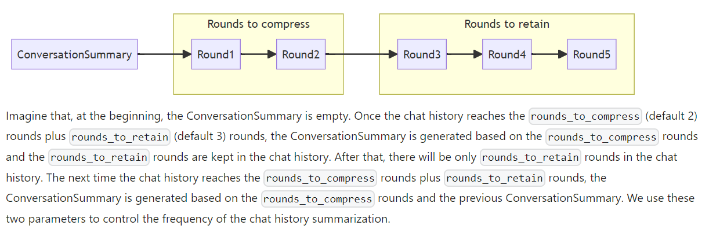

# How to manage chat history for your chatbot?

## Task Introduction

引入多轮对话的目的在于，尽量降低token的消耗，chatbot可以结合历史会话达到更好的效果。可以考虑到，token的消耗以及最相关的chat history是解决这一问题需要平衡的两面。

## Some approaches to solving the problem

有以下几种方法处理chat history

|  | pros | cons |
| --- | --- | --- |
| default | 1. 完整的存储chat history2. 最简单直接 | 1. token消耗巨大，时延巨大2. 达到LLm token limit，无法记住超过限制的对话 |
| summarizing | 1. 缩短了chat history的token数量2. 可以容纳更长的对话轮次3. 相对直接的视线，简单易懂 | 1. chat history完全依赖于LLM的摘要能力，2. 需要使用LLM对chat history摘要（消耗token） |
| memory | 1. 具备近期完整的chat history | 1. 久远的chat history没有保留 |
| trunk & retrieval | 1. token消耗少2. 选择最相关的chat history chunk | 1. 不是完整的chat history，存在语义偏差2. 可能错过最近的chat history |

## The strategies to managing chat history

在上面的介绍中提及了两面，为了平衡他们，需要综合应用上面提及的方法。再仔细分析下这两面：

### Relevance

确定过去对话中可能对生成下一条消息有用的部分。常见的相关信号包括：

- 消息的时效性：最后几条消息比上个月的消息更有可能相关。
- 相似性：具有相似嵌入或与最后几条消息使用相同罕见关键字的消息更有可能相关。
- 会话上下文：用户在产品中的近期操作可能提供有关哪些消息可能更相关的信息。

### Token Control

- 必须在当前大模型满足的最大token内对话
- Compression：将先前的聊天历史发送到具有大上下文窗口的提示以总结对话或提取关键细节/关键字，然后将其作为输入发送到另一个在该压缩表示的聊天历史上操作的提示。可以采用各种提示工程技术来压缩先前的对话（例如，简单总结、提取主要主题、提供时间线等），正确的选择取决于您想要实现的用户体验。

## Basic steps

1. 构建基于大模型最大token数量的上下文管理(slide window to avoid overrun the max token)
2. 会话压缩：对于大模型给出的超长回复，可以对其进行压缩，缺点是信息衰减，但是如果用户接下来问超长回复的具体细节，那么压缩大概率无法给出合理的答案，解决方式是构建层级的会话压缩。（需要考虑采用什么模型或者什么prompt做压缩）
3. 自定义选择更相关的历史会话与过滤无效或低质的会话
    1. 自定义选择更相关的历史会话：使用向量数据库选择更相关的历史会话
    2. 过滤无效或低质的会话：构建一个会话打分器，低质不进入历史会话存储
4. 时间因素
    1. 较大时间差的会话相关性较小，用户偏好开启新话题：最近的一条对话与当前对话的时间差有2小时，那么可以认为用户大概率会开启一个新的话题，那么之前的chat history就可以丢弃
    2. 在连续会话过程中，离当前会话越远，价值越低，可以被压缩，离当前会话越近，价值越高，需要有限压缩或者不压缩
        - Recent history: Uncompressed
        - Mid-term history: Lightly compressed
        - Long-term history: Heavily summarized
    3. 压缩的粒度：
        1. 以每一轮次为粒度进行压缩，这种将不同时间发生的对话视为同等重要
        2. 随着对话轮次变的更大，那些久远的会话可以被合并，如下图
            
            
            

## TaskWeaver Conversation strategy

下图展示了Taskweaver中管理会话的方法[3]

## Reference

1. https://www.pinecone.io/learn/series/langchain/langchain-conversational-memory/
2. [https://www.vellum.ai/blog/how-should-i-manage-memory-for-my-llm-chatbot](https://www.vellum.ai/blog/how-should-i-manage-memory-for-my-llm-chatbot)
3. [https://microsoft.github.io/TaskWeaver/docs/advanced/compression/](https://microsoft.github.io/TaskWeaver/docs/advanced/compression/)
4. [https://devblogs.microsoft.com/surface-duo/android-openai-chatgpt-18/](https://devblogs.microsoft.com/surface-duo/android-openai-chatgpt-18/)
5. [https://devblogs.microsoft.com/surface-duo/android-openai-chatgpt-19/](https://devblogs.microsoft.com/surface-duo/android-openai-chatgpt-19/)